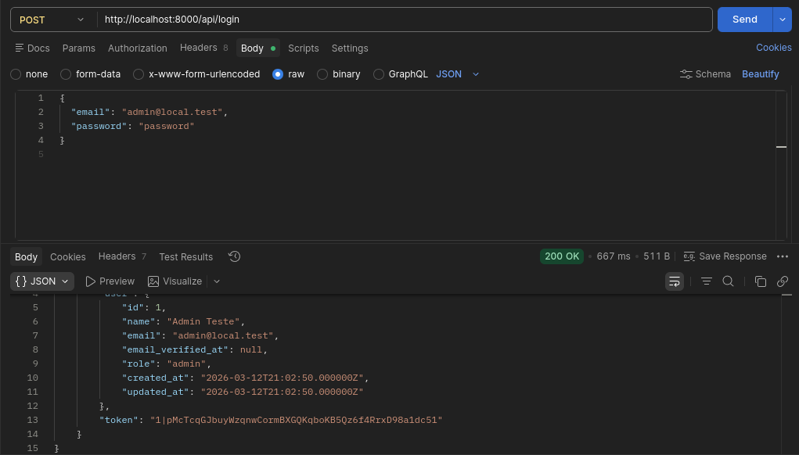
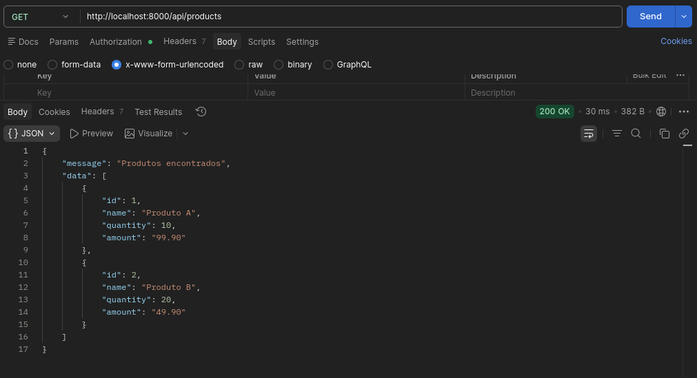
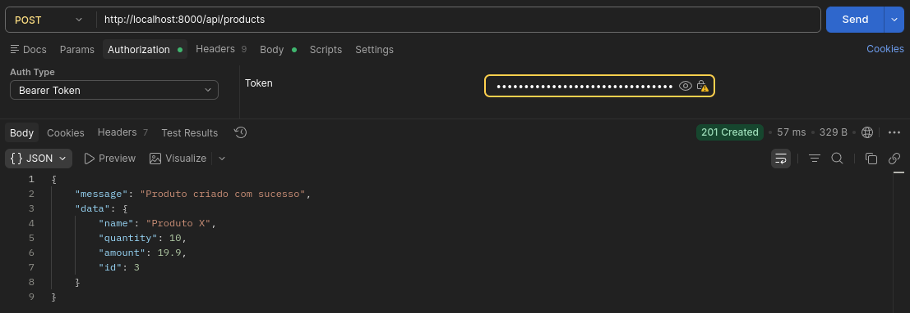
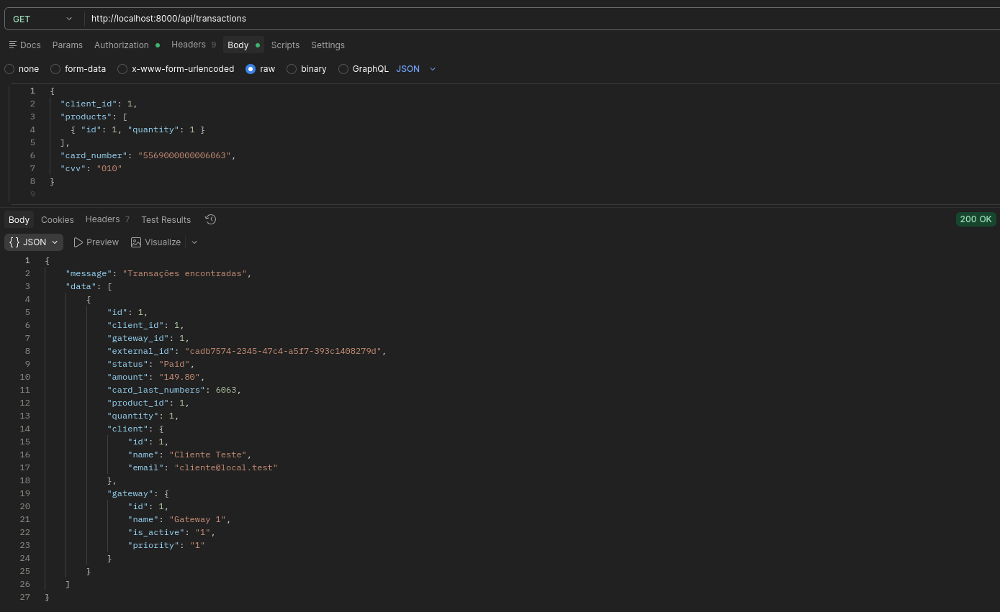
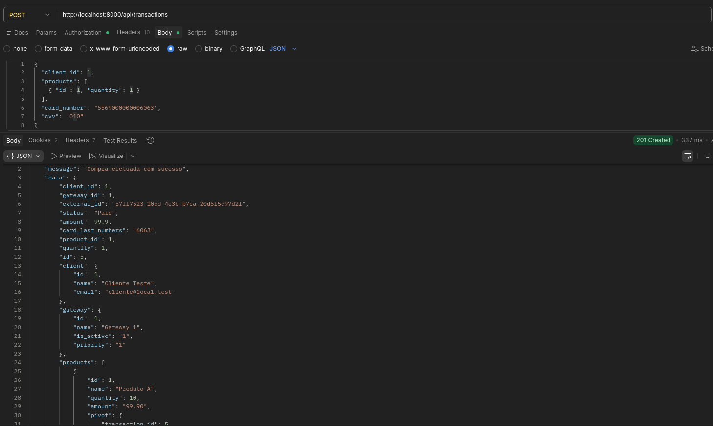
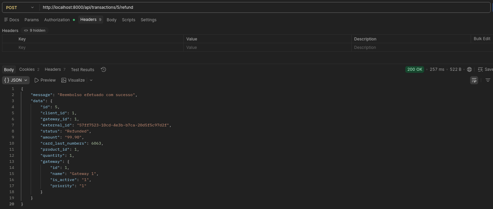

# Payment Gateway API

API REST para gerenciar pagamentos multi-gateway com fallback por prioridade.

**Nivel:** 2 (Junior)

## Requisitos
- PHP 8.2+
- Composer
- MySQL
- Docker (opcional, para subir o ambiente completo)

## Passo a passo (Local)
1. Instalar dependencias:
```bash
composer install
```
2. Criar o arquivo de ambiente:
```bash
cp .env.example .env
```
3. Ajustar `.env` para LOCAL (ver `.env.example` com blocos local/docker comentados).
3. Gerar chave da aplicacao:
```bash
php artisan key:generate
```
4. Rodar migrations + seed:
```bash
php artisan migrate:fresh --seed
```
5. Subir a aplicacao:
```bash
php artisan serve
```
6. (Opcional) Subir os mocks dos gateways se estiver rodando local:
```bash
docker run -p 3001:3001 -p 3002:3002 matheusprotzen/gateways-mock
```

## Passo a passo (Docker)
1. Subir todos os servicos:
```bash
docker compose up -d
```
2. Ajustar `.env` para DOCKER (ver `.env.example` com blocos local/docker comentados).
3. Rodar migrations + seed dentro do container:
```bash
docker compose exec app php artisan migrate:fresh --seed
```

## Seed de teste
O seeder cria:
- 1 usuario admin (`admin@local.test` / `password`)
- 2 gateways
- 1 cliente
- 2 produtos
- 1 transacao + itens

Rodar manualmente:
```bash
php artisan db:seed
```

## Testes Automatizados (TDD)
Este projeto possui testes automatizados.

**Rodando local:**
```bash
php artisan test
```

**Rodando no Docker:**
```bash
docker compose exec app php artisan test
```


## Autenticacao
Base URL (local): `http://localhost:8000/api`

### Login (publica)
- Metodo: `POST`
- URL: `/login`
- Headers:
  - `Content-Type: application/json`
- Body:
```json
{
  "email": "admin@local.test",
  "password": "password"
}
```
Retorna token para usar nas rotas privadas:
```
Authorization: Bearer <token>
```

### Compra (publica)
- Metodo: `POST`
- URL: `/transactions`
- Headers:
  - `Content-Type: application/json`
- Body:
```json
{
  "client_id": 1,
  "products": [
    { "id": 1, "quantity": 1 }
  ],
  "card_number": "5569000000006063",
  "cvv": "010"
}
```

## Rotas principais
### Rotas privadas (Bearer Token)
Headers padrao:
- `Authorization: Bearer <token>`

#### Users
- `GET /users`
- `POST /users`
Body:
```json
{
  "name": "Manager Teste",
  "email": "manager@local.test",
  "role": "manager",
  "password": "password"
}
```
- `GET /users/{id}`
- `PATCH /users/{id}`
Body:
```json
{
  "name": "Novo Nome"
}
```
- `DELETE /users/{id}`

#### Products
- `GET /products`
- `POST /products`
Body:
```json
{
  "name": "Produto X",
  "quantity": 10,
  "amount": 19.90
}
```
- `GET /products/{id}`
- `PATCH /products/{id}`
Body:
```json
{
  "amount": 29.90
}
```
- `DELETE /products/{id}`

#### Clients
- `GET /clients`
- `GET /clients/{id}`
- `GET /clients/{id}/details`
- `GET /clients/{id}/purchases`
- `GET /clients/purchases/{transaction_id}`

#### Transactions
- `GET /transactions`
- `GET /transactions/{id}`
- `POST /transactions/{id}/refund`
Body (reembolso):
```json
{}
```
Obs: rota de reembolso nao exige body, apenas o `id` na URL.

#### Clients Refund
- `POST /clients/purchases/{transaction_id}/refund`
Body (reembolso):
```json
{}
```
Obs: rota de reembolso nao exige body, apenas o `transaction_id` na URL.

#### Gateways
- `PATCH /gateways/{id}/activate`
- `PATCH /gateways/{id}/deactivate`
- `PATCH /gateways/{id}/priority`
Body:
```json
{
  "priority": 1
}
```
Obs: `activate` e `deactivate` nao exigem body.

## Gateways mock
O compose ja sobe os mocks:
- Gateway 1: `http://localhost:3001`
- Gateway 2: `http://localhost:3002`

Variaveis de ambiente usadas:
- `GATEWAY1_URL`
- `GATEWAY1_EMAIL`
- `GATEWAY1_TOKEN`
- `GATEWAY2_URL`
- `GATEWAY2_TOKEN`
- `GATEWAY2_SECRET`

## Arquitetura e Padroes
**Arquitetura:** Controllers + Services + Requests (FormRequest) com middlewares e policies para controle de acesso.

**Validacoes:** Todas as entradas sensiveis sao validadas em `FormRequest`, deixando os controllers focados apenas no fluxo.

**Eloquent:** Models representam as entidades (Users, Clients, Products, Gateways, Transactions) e relacionamentos (transactions ↔ products).

**Enums:** Status de transacao padronizado em `App\\TransactionStatus` (ex: `Pending`, `Paid`, `Failed`, `Refunded`).

## Postman
Login:


Listagem de produtos:


Criacao de produto:


Compra (transactions):


Compra (transactions - produto):


Reembolso efetuado:



## ⏰ Considerações Finais
- Tudo que foi construído está em funcionamento (compra, refund, gateways).
- Dificuldade principal: gateway retornando 201 e o fluxo tratava como erro. Ajustado para aceitar 2xx.